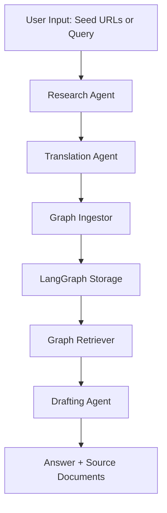

# 🧠 AI Deep Research Agent System

> Built by [@tejash-paney](https://github.com/tejash-300)

An end-to-end AI system that performs **deep web research** using Tavily, structures knowledge using LangGraph, and drafts answers using LangChain RetrievalQA. Designed with modular agents for crawling, translation, ingestion, and answer generation.

---

## 🚧 Project Purpose

This system automates the process of:

- Crawling relevant web pages from seed URLs or queries  
- Translating non-English content to English  
- Storing and embedding knowledge into LangGraph  
- Retrieving and synthesizing information via LangChain

This aligns with the assignment goal of designing an **AI Agent-based Deep Research System**.

---

## 📐 System Architecture

### 🔧 Flowchart Overview



### 🧩 Component Roles

| Component          | Role                                                                 |
|--------------------|----------------------------------------------------------------------|
| `ResearchAgent`     | Uses Tavily to fetch or search content from the web                 |
| `TranslationAgent`  | Detects and translates non-English text using Deep Translator       |
| `GraphIngestorWithCred` | Scores credibility, chunks, embeds, and stores in LangGraph         |
| `GraphRetriever`    | Pulls documents and builds a vector index using LangChain + Chroma  |
| `DraftingAgent`     | Uses RetrievalQA from LangChain to generate answers with citations  |

> ⚠️ All agents run sequentially and gracefully degrade (e.g., fallback to local vector retrieval if LangGraph is unavailable).

---

## 📁 Folder Structure

```
ai-deep-research-agent/
│
├── agents/
│   ├── research_agent.py          # Crawling & search via Tavily
│   ├── translation_agent.py       # Translation into English
│   ├── graph_ingestor.py          # Credibility scoring, chunking, ingestion
│   ├── graph_retriever.py         # Chroma retriever with fallback
│   └── drafting_agent.py          # Answer generation using RetrievalQA
│
├── utils.py                       # Helper functions for chunking & embedding
├── main.py                        # Entry point to run the pipeline
├── requirements.txt               # Python dependencies
├── .env                           # Your API keys
└── README.md                      # You're reading it!
```

---

## ⚙️ Setup Instructions

1. **Clone the repository**
   ```bash
   git clone https://github.com/tejash-paney/ai-deep-research-agent.git
   cd ai-deep-research-agent
   ```

2. **Install dependencies**
   ```bash
   pip install -r requirements.txt
   ```

3. **Create `.env` with your API keys**
   ```env
   TAVILY_API_KEY=your-tavily-key
   LANGGRAPH_API_KEY=your-langgraph-key
   OPENAI_API_KEY=your-openai-key
   ```

---

## 🚀 Usage

### Run the pipeline

```bash
python main.py
```

This script will:
- Crawl the seed URLs
- Translate and score content
- Ingest it into LangGraph
- Retrieve relevant data
- Draft a final answer with sources

> Works even if LangGraph is unreachable—it will fallback to local document retrieval.

---

## ✅ Example Output

```
✅ Model returned an answer:
AI is the capability of machines to perform tasks typically associated with human intelligence.

📑 Sources:
- https://en.wikipedia.org/wiki/Artificial_intelligence: AI refers to the capability of computational systems to...
```

---

## 💡 Future Improvements

- Integrate PDF/YouTube ingestion
- Add GUI or web interface
- Multi-agent asynchronous execution with LangGraph workflows
- Enhanced summarization and Q&A with RAG pipelines

---

## 🧑‍💻 Contributing

Pull requests welcome! Please fork the repo and submit a clean PR.

---

## 🪪 License

MIT License. See [`LICENSE`](LICENSE).

---

## 📬 Contact

Made with ❤️ by [Tejash Paney](https://github.com/tejash-300)  
Email: (mailto:tejashpandey740@gmail.com)

